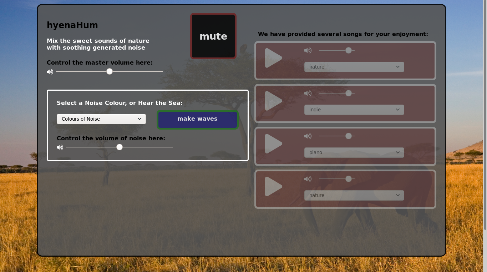

# hyena/Hum
### a webapp to modulate and loop your background noise       
## MVPs
- [x] intuitive ui - simple controls, simple visualization 
- [x] control and stream sound       
    * PreSet White, Pink, and Brown Noises      
    * Loaded with appropriate Seed Sounds
- [x] select and combine multiple sounds 
- [x] scripturally modulate volume, then other effects. first combined, then individually 

## Description    

Many Looping applications allow the user to make music, this one is for making noise. 

Panel will load with a Pink Noise Loop PreSet. The most natural of the Noises.     
Users will be presented with a clear interface to turn the noises on or off, aswellas individual volume knobs. Speed and/or Pitch, continuous active volume modulation, and other effects will be added later.     
Users can edit or accompany their Loaded Loops, either with PreSet Noises, Provided Sounds, or User UpLoaded Files. Custom, Generated Noises will be added as an additional feature. 

This project taught me to design a ui from the ground up, and how to best interface with the default media elements.

I also learned a lot about the underlying wave science.

## Arch & Tech

* Thanks to modern web technologies, I can provide most of this functionality through customization of the `<audio>` element. 
* Still thinking in React but VanillaJS DOM manipulation methods are much more direct tools to update the ui.
    * augmented with CSS styling to increase intuitiveness. 
* Leverages the `WebAudioAPI` for Noise Generation and advanced audio manipulation.        

## WebAudioAPI

* A complex aspect of the new web audio standard is the ability to link different audio "nodes" together to control noise inputs. It was difficult for me to handle multiple noise nodes all connecting to the same master node, 
    * I solved this through a switch statement controlling every aspect of the connection and disconnection:

            function noiseSelect() {
                switch (noiseSelector.value) {
                    case 'white':
                        // volumeControl.value = 0.3
                        whiteGain = context.createGain()
                        whiteGain.gain.value = 0.3;
                        whiteNoise.connect(whiteGain).connect(noiseGainNode).connect(masterGainNode).connect(context.destination);
                        break;
                    case 'pink':
                        pinkNoise.connect(noiseGainNode).connect(masterGainNode).connect(context.destination);
                        break;
                    case 'brown':
                        brownNoise.connect(noiseGainNode).connect(masterGainNode).connect(context.destination);
                        break;
                    case 'none':
                        pinkNoise.disconnect()
                        brownNoise.disconnect()
                        whiteNoise.disconnect()
                        break;
                    case 'custom':
                        oneSound.alertUpload();
                        this.noiseSelector.value = 'none';
                        break;
                }
            }